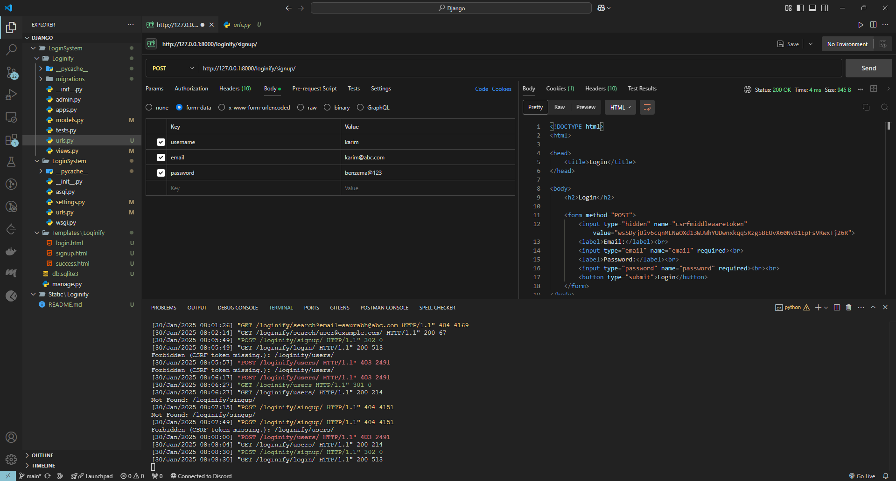
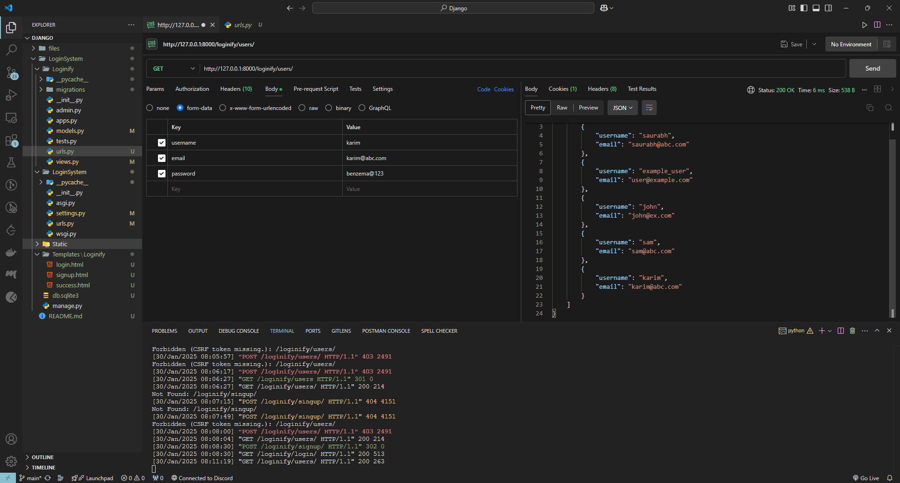
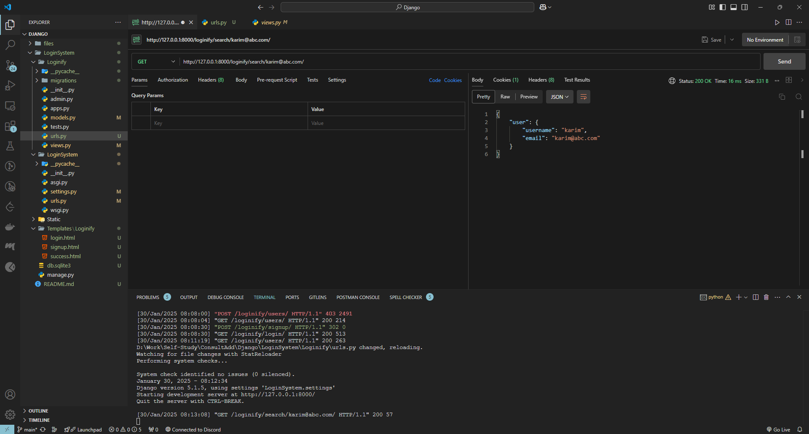
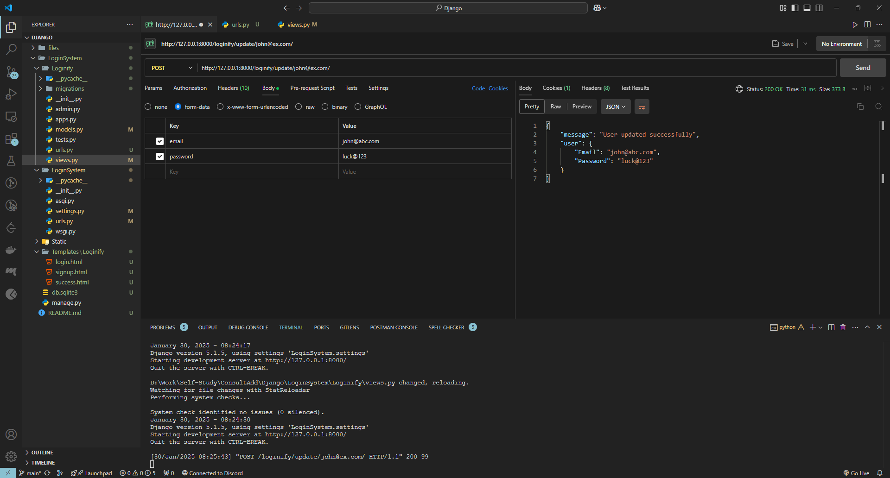
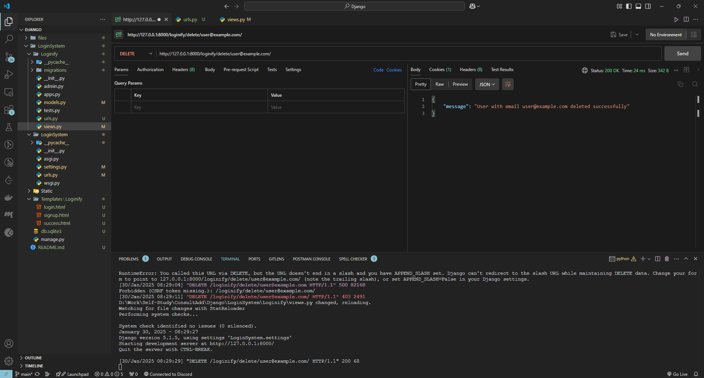
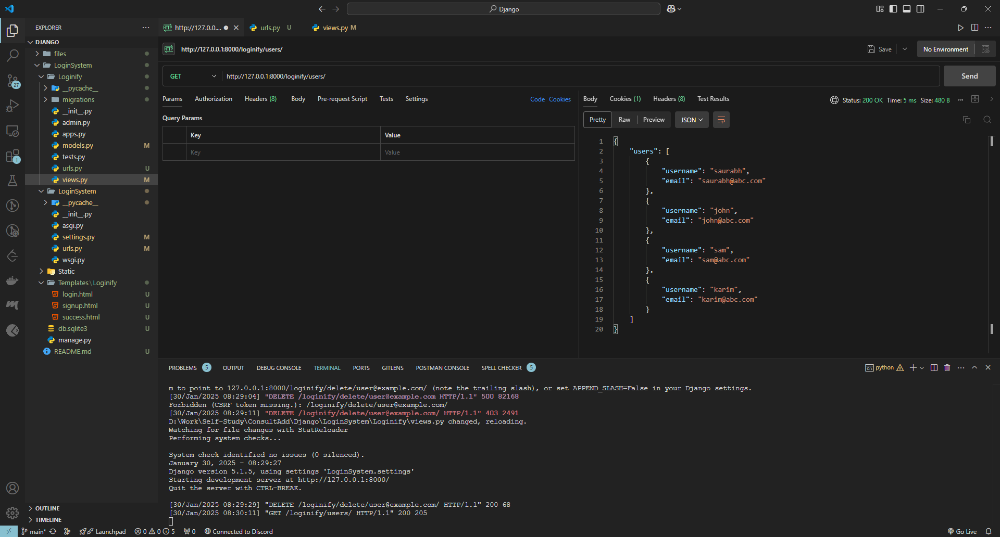

# Django Login System - README

## **Project Description**

This Django project implements a login system, "Loginify," that includes CRUD (Create, Read, Update, Delete) operations for user management. It provides features for creating, retrieving, updating, and deleting user details through API endpoints. The project also utilizes Django's admin interface and is tested thoroughly using Postman.

---

## **Project Setup**

### **1. Virtual Environment**

- Create a virtual environment:
  ```bash
  python -m venv django
  ```
- Activate the virtual environment:
  - Windows:
    ```bash
    django\Scripts\activate
    ```
  - macOS/Linux:
    ```bash
    source django/bin/activate
    ```
- Install Django:
  ```bash
  pip install django
  ```

### **2. Create Django Project**

- Create a new Django project named "LoginSystem":
  ```bash
  django-admin startproject LoginSystem
  ```

### **3. Create Django Application**

- Create an app named "Loginify":
  ```bash
  python manage.py startapp Loginify
  ```

---

## **Models**

The `UserDetails` model includes the following fields:

- **username**: Primary key (CharField, max length 50)
- **email**: Unique field (EmailField)
- **password**: CharField (max length 12)

---

## **Views and Endpoints**

The application provides the following CRUD views:

### **1. Create User**

- **Endpoint**: `/loginify/signup/`
- **Method**: POST
- **Description**: Creates a new user.
- **Fields**:
  - `username`
  - `email`
  - `password`

### **2. Get All Users**

- **Endpoint**: `/loginify/users/`
- **Method**: GET
- **Description**: Retrieves and displays details of all users.

### **3. Get User by Email**

- **Endpoint**: `/loginify/search/<email>/`
- **Method**: GET
- **Description**: Retrieves a specific user's details based on their email.

### **4. Update User**

- **Endpoint**: `/loginify/update/<email>/`
- **Method**: POST
- **Description**: Updates a user's username and/or password.

### **5. Delete User**

- **Endpoint**: `/loginify/delete/<email>/`
- **Method**: DELETE
- **Description**: Deletes a user based on their email.

---

## **URLs Configuration**

Ensure `Loginify/urls.py` contains:

```python
from django.urls import path
from . import views

urlpatterns = [
    path("hello/", views.hello, name='hello'),
    path("login/", views.user_login, name='login'),
    path("signup/", views.user_create, name='signup'),
    path("users/", views.get_all_users, name='get_all'),
    path("search/<str:email>/", views.get_by_email, name="search_by_email"),
    path("update/<str:email>/", views.update_by_email, name="update_by_email"),
    path("delete/<str:email>/", views.del_by_email, name="del_by_email"),
]
```

Include these URLs in the project's main `urls.py`:

```python
from django.urls import path, include

urlpatterns = [
    path('loginify/', include('Loginify.urls')),
]
```

---

## **Admin Configuration**

- Create a superuser to access the Django admin interface:
  ```bash
  python manage.py createsuperuser
  ```
- Verify user creation and management through the admin panel at `/admin/`.

---

## **Testing the API with Postman**

### **1. Create User**

- **URL**: `http://127.0.0.1:8000/api/create/`
- **Method**: POST
- **Body (form-data)**:
  - `username`: `example_user`
  - `email`: `user@example.com`
  - `password`: `example123`

### **2. Get All Users**

- **URL**: `http://127.0.0.1:8000/api/users/`
- **Method**: GET

### **3. Get User by Email**

- **URL**: `http://127.0.0.1:8000/api/user/user@example.com/`
- **Method**: GET

### **4. Update User**

- **URL**: `http://127.0.0.1:8000/api/update/user@example.com/`
- **Method**: POST
- **Body (form-data)**:
  - `email`: `new_user@abc.com`
  - `password`: `new_pwd@123`

### **5. Delete User**

- **URL**: `http://127.0.0.1:8000/api/delete/new_user@abc.com/`
- **Method**: DELETE

---

## **File Structure**

```
Login_System/
|├── Loginify/
    |├── __pycache__/
|   |├── migrations/
|   |├── __init__.py
|   |├── admin.py
|   |├── apps.py
|   |├── models.py
    |├── tests.py
|   |├── views.py
|   |├── urls.py
|├── Login_System/
    |├── __pycache__/
|   |├── __init__.py
    |├── asgi.py
|   |├── settings.py
|   |├── urls.py
|   |├── wsgi.py
|├── Static/
|├── db.sqlite3
|├── manage.py
```

---

## **Commands Summary**

- Run the server:
  ```bash
  python manage.py runserver
  ```
- Apply migrations:
  ```bash
  python manage.py makemigrations
  python manage.py migrate
  ```
- Access the admin panel:
  ```
  http://127.0.0.1:8000/admin/
  ```

---

## **Screenshots**

Postman:
User Signup:

All Users:

Search:

Update:

Delete:

Final List of Users:


---

## **Author**

- **[Saurabh Takle]** (https://github.com/saura-t) - Primary developer
